# Domaine Active Directory durci — Lab GNS3

Déploiement et durcissement d'un domaine **Active Directory** sous **Windows Server 2022**,
émulé dans **GNS3**. Le projet couvre l'installation d'un contrôleur de domaine, la
construction d'une structure d'annuaire, la jonction d'un poste client, et le durcissement
par **stratégies de groupe alignées sur les recommandations ANSSI** : politique de mots de
passe, restriction des privilèges, et audit des connexions.

Chaque choix technique est justifié, chaque étape est démontrable par capture.

---

## Sommaire

- [Objectif](#objectif)
- [Topologie](#topologie)
- [Plan d'adressage](#plan-dadressage)
- [Composants](#composants)
- [1. Contrôleur de domaine](#1-contrôleur-de-domaine)
- [2. Structure d'annuaire](#2-structure-dannuaire)
- [3. Jonction du poste client](#3-jonction-du-poste-client)
- [4. Durcissement ANSSI](#4-durcissement-anssi)
- [Démonstration](#démonstration)
- [Pièges rencontrés et résolus](#pièges-rencontrés-et-résolus)
- [Scripts](#scripts)

---

## Objectif

Construire un domaine Active Directory réaliste et le durcir selon un référentiel
reconnu, de façon à obtenir :

- un annuaire structuré (unités d'organisation, groupes de sécurité, utilisateurs) ;
- un poste client joint au domaine et authentifié de façon centralisée ;
- un durcissement démontrable : une même machine applique des restrictions à un
  utilisateur standard mais pas à un administrateur ;
- une journalisation des authentifications exploitable pour la détection d'intrusion.

---

## Topologie

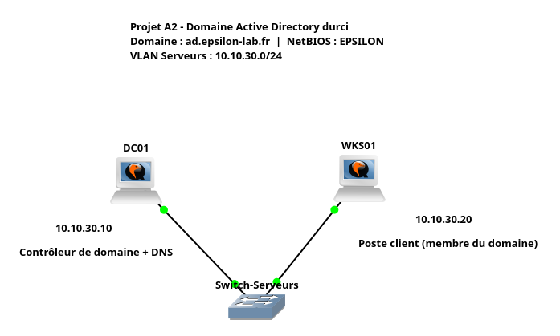

Topologie volontairement minimale — un contrôleur de domaine et un client — suffisante
pour démontrer l'annuaire, les GPO et l'audit. En production, on ajouterait un second
contrôleur pour la redondance et l'intégrerait à l'infrastructure réseau (voir le projet
complémentaire *Infrastructure réseau d'entreprise sécurisée*).

---

## Plan d'adressage

| Machine | Rôle | IP | Passerelle | DNS |
|---|---|---|---|---|
| **DC01** | Contrôleur de domaine + DNS | `10.10.30.10` | `10.10.30.1` | `127.0.0.1` |
| **WKS01** | Poste client (membre) | `10.10.30.20` | `10.10.30.1` | `10.10.30.10` |

- **Domaine :** `ad.epsilon-lab.fr` — **NetBIOS :** `EPSILON`
- **Segment :** `10.10.30.0/24` (VLAN Serveurs, cohérent avec le projet A1)

Détails dans [`docs/plan-adressage.md`](docs/plan-adressage.md).

### Pourquoi un sous-domaine, et pas `.local`

Le domaine est créé sur `ad.epsilon-lab.fr`, un **sous-domaine**, comme on le ferait en
production sous un domaine détenu par l'entreprise. Le suffixe `.local` a été écarté : il
est **réservé au protocole mDNS** (Bonjour, Avahi) et provoque des conflits de résolution
avec les postes macOS et Linux. La recommandation actuelle de Microsoft et de l'ANSSI est
d'utiliser un sous-domaine d'un domaine public que l'on possède.

---

## Composants

| Composant | Rôle |
|---|---|
| **Windows Server 2022** (Desktop Experience) | OS des deux machines (évaluation 180 j) |
| **AD DS** | Service d'annuaire — contrôleur de domaine |
| **DNS intégré** | Résolution et publication des services AD (SRV) |
| **GPO** | Stratégies de groupe — durcissement |
| **PowerShell** | Automatisation de la configuration |
| **GNS3 / QEMU / KVM** | Émulation |

---

## 1. Contrôleur de domaine

### Configuration réseau

Le contrôleur reçoit une **IP statique** : il héberge le DNS du domaine, référencé par
tous les clients. Une adresse dynamique casserait la résolution de l'ensemble du domaine.

Le DNS du contrôleur **pointe vers lui-même** (`127.0.0.1`) : Active Directory publie ses
services (Kerberos, LDAP, catalogue global) via des enregistrements SRV dans le DNS ; le
contrôleur doit donc s'interroger localement.

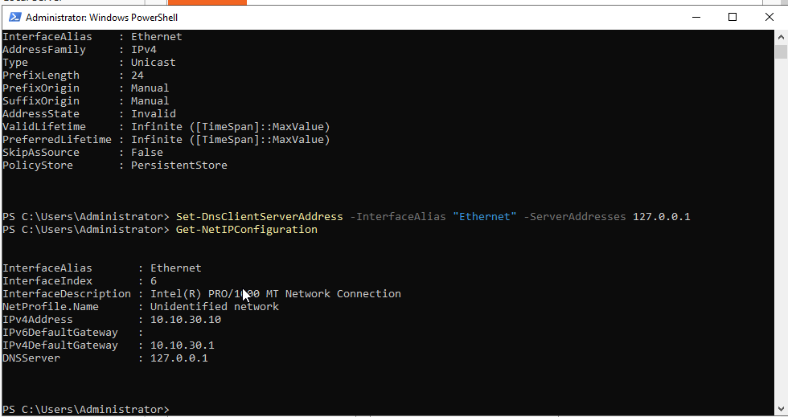

### Promotion en contrôleur de domaine

Le serveur est **renommé avant** la promotion : le nom d'un contrôleur est inscrit dans le
DNS et la base AD, le changer après coup imposerait une rétrogradation.

La forêt est créée au niveau fonctionnel Windows Server 2016. La promotion demande un mot
de passe **DSRM** (*Directory Services Restore Mode*), compte de secours distinct de
l'administrateur, utilisé pour restaurer un contrôleur dont la base serait corrompue.

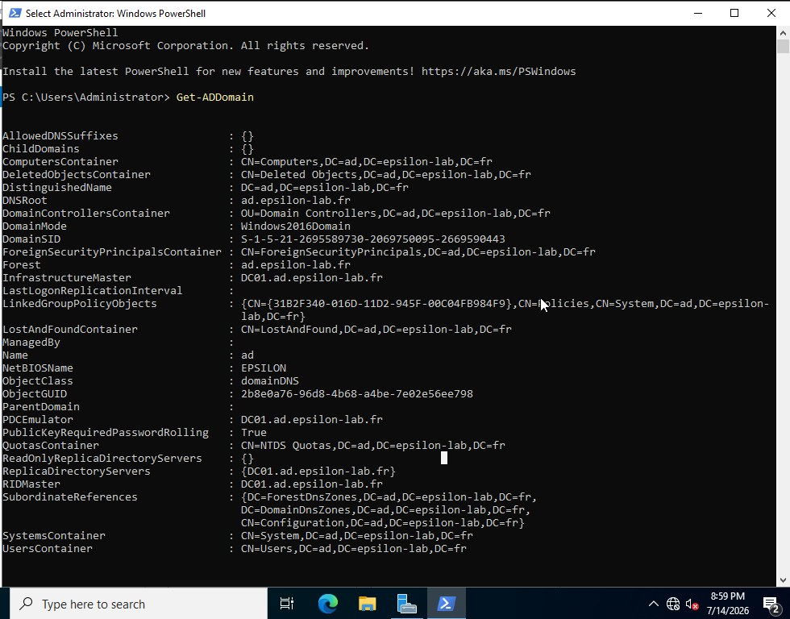

### Vérification du DNS

Le test décisif : l'enregistrement SRV que tout client interroge pour localiser un
contrôleur répond correctement.

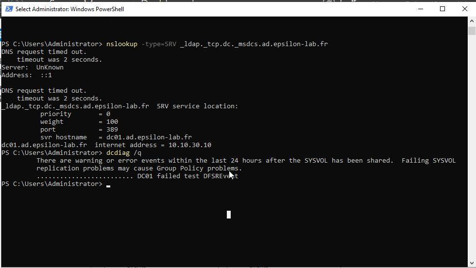

```
_ldap._tcp.dc._msdcs.ad.epsilon-lab.fr   SRV service location:
    svr hostname = dc01.ad.epsilon-lab.fr
dc01.ad.epsilon-lab.fr  internet address = 10.10.30.10
```

---

## 2. Structure d'annuaire

L'arborescence est créée explicitement — on n'utilise **jamais** les conteneurs par défaut
(`CN=Users`, `CN=Computers`) : ce ne sont pas des unités d'organisation, on ne peut pas
leur lier de GPO.

```
OU=EPSILON
├── OU=Utilisateurs
│   ├── OU=IT
│   ├── OU=RH
│   └── OU=Commercial
├── OU=Groupes
├── OU=Ordinateurs
└── OU=Serveurs
```

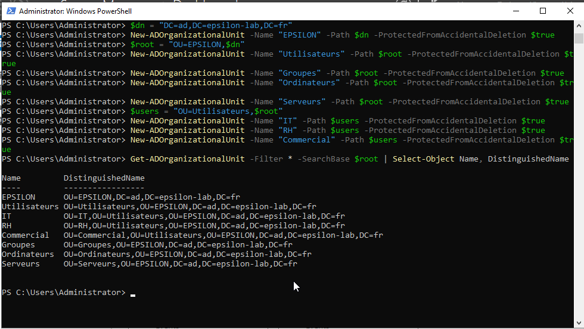

### Groupes et utilisateurs

Trois groupes de sécurité globaux (convention `GG_` = *Global Group*) et quatre
utilisateurs répartis par département. Le compte **`bruce.admin`** est un compte
d'administration **distinct** du compte quotidien — recommandation ANSSI centrale : ne
jamais effectuer de tâches courantes (messagerie, navigation) avec un compte à privilèges.

| Utilisateur | OU | Groupe |
|---|---|---|
| `bruce.admin` | IT | `GG_IT_Admins` |
| `marie.dupont` | RH | `GG_RH_Users` |
| `jean.martin` | Commercial | `GG_Commercial_Users` |
| `sophie.leroy` | Commercial | `GG_Commercial_Users` |

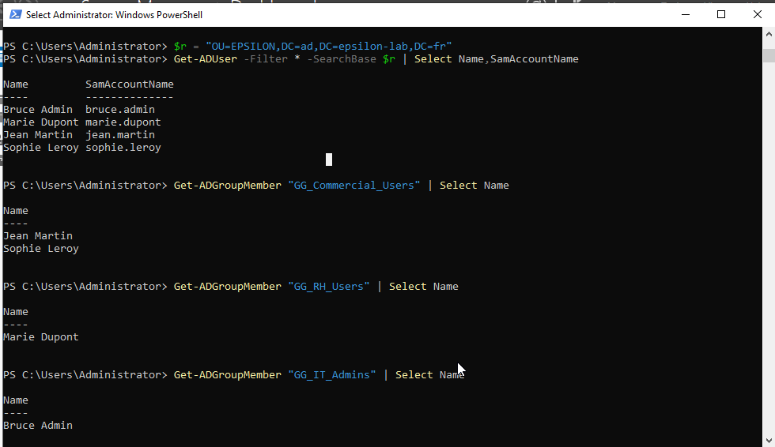

---

## 3. Jonction du poste client

Le client **WKS01** utilise **DC01 comme serveur DNS** (`10.10.30.10`) — condition
indispensable : pour rejoindre le domaine, il doit localiser le contrôleur via les
enregistrements SRV publiés dans le DNS de DC01.

Après jonction, un utilisateur du domaine peut ouvrir une session : le poste délègue son
authentification au contrôleur via Kerberos.

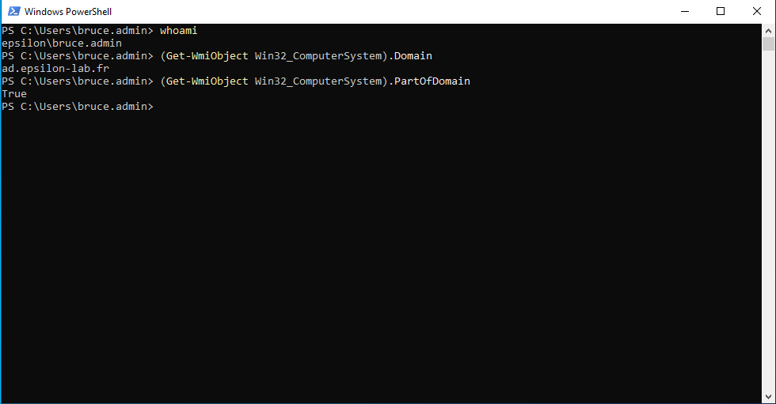

```
whoami                              -> epsilon\bruce.admin
Win32_ComputerSystem.Domain         -> ad.epsilon-lab.fr
Win32_ComputerSystem.PartOfDomain   -> True
```

---

## 4. Durcissement ANSSI

### Politique de mots de passe

| Paramètre | Valeur | Justification |
|---|---|---|
| Longueur minimale | 12 | Résistance au cassage hors ligne |
| Historique | 24 | Empêche la réutilisation cyclique |
| Âge maximal | 90 j | Limite la fenêtre d'exploitation |
| Âge minimal | 1 j | Empêche de contourner l'historique |
| Complexité | Activée | 3 des 4 catégories |
| **Verrouillage** | **5 échecs / 30 min** | **Défense anti force brute** |
| Chiffrement réversible | Désactivé | Jamais de stockage réversible |

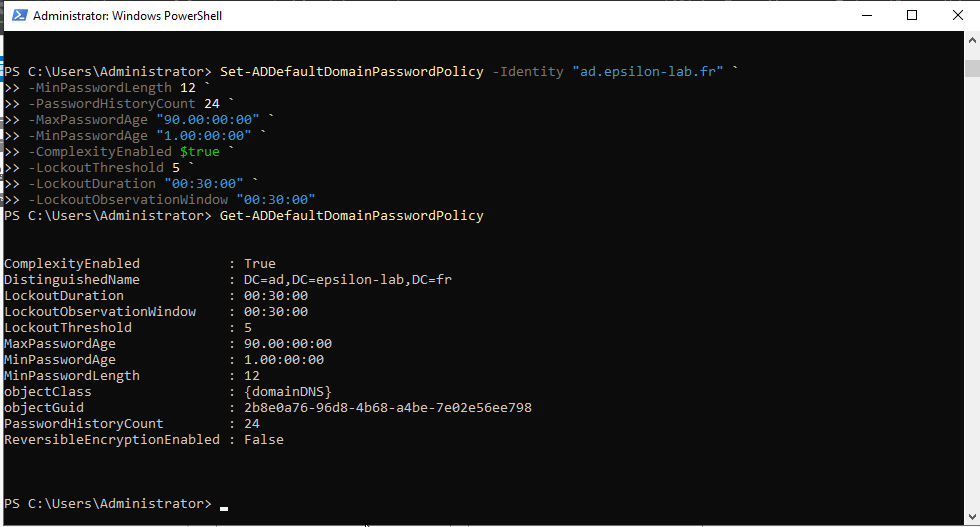

> **Nuance :** l'expiration périodique des mots de passe est aujourd'hui débattue (NIST,
> guides ANSSI récents) : elle pousse les utilisateurs vers des variations prévisibles.
> L'approche moderne privilégie des mots de passe longs, non expirants, mais vérifiés
> contre les bases de fuites. Le réglage à 90 jours est ici un choix classique, à adapter
> au contexte.

### Restriction des privilèges (GPO)

Une GPO liée à l'OU Utilisateurs bloque, pour les comptes standard, l'accès au **Panneau
de configuration**, à l'**invite de commandes** et à l'**éditeur de registre** — principe
du moindre privilège appliqué à l'interface.

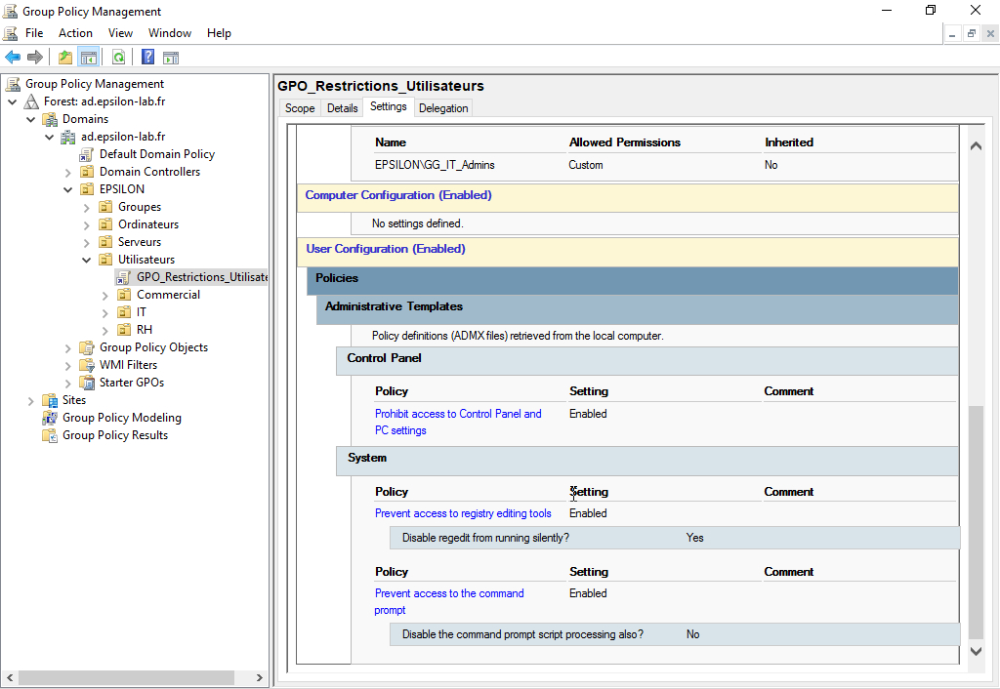

**Exclusion des administrateurs** — les membres de `GG_IT_Admins` sont exemptés via un
**Deny sur « Apply group policy »**. Un Deny explicite prime toujours sur un Allow :
résultat, la restriction s'applique à tous *sauf* aux administrateurs.

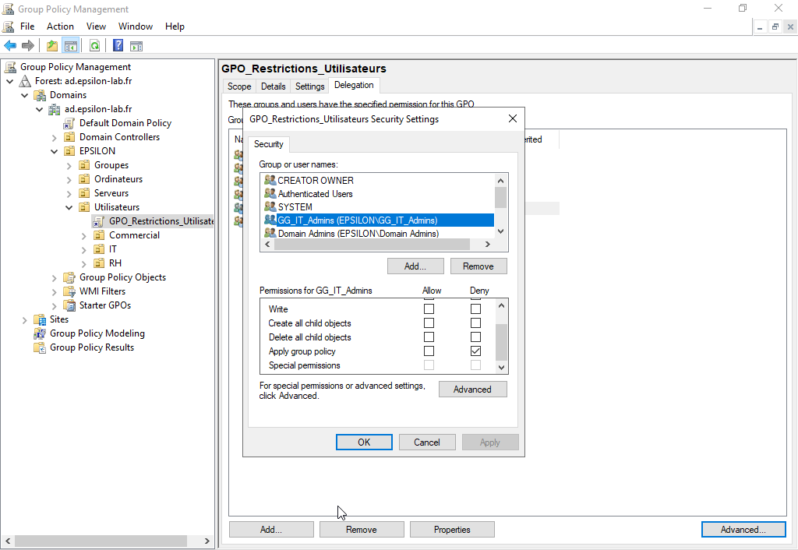

### Audit des connexions (GPO)

Une GPO liée au domaine journalise chaque connexion réussie (**4624**) et échouée
(**4625**). Une série de 4625 sur un même compte est la signature d'une attaque par force
brute. Les échecs de comptes de domaine sont journalisés **sur le contrôleur** (c'est lui
qui valide via Kerberos).

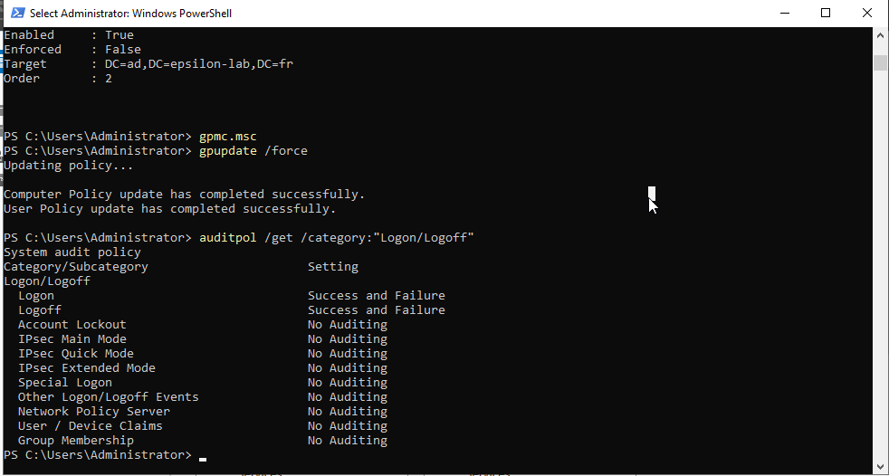

---

## Démonstration

Le durcissement produit un **comportement différencié sur la même machine** :

| | `bruce.admin` (IT) | `marie.dupont` (RH) |
|---|---|---|
| Panneau de configuration | ✅ Ouvert | ❌ Bloqué |
| Éditeur de registre | ✅ | ❌ Bloqué |
| Invite de commandes | ✅ | ❌ Bloqué |

**Administrateur — accès autorisé :**

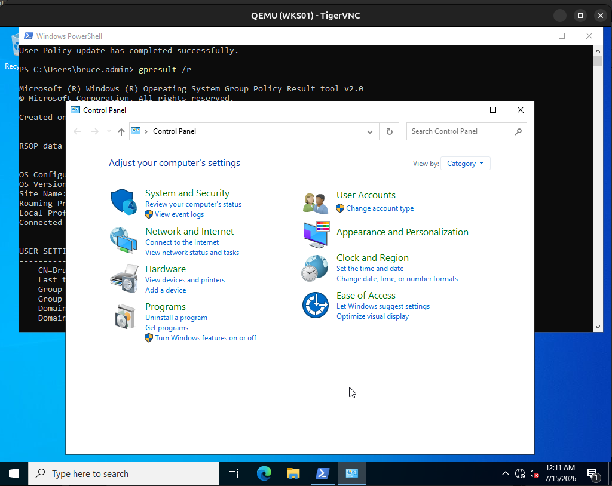

**Utilisateur standard — accès bloqué :**

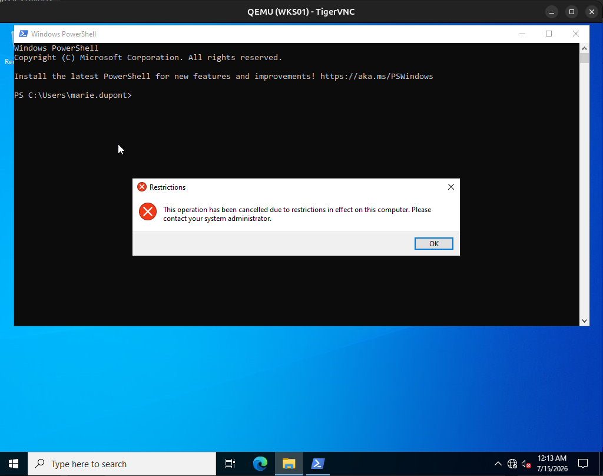

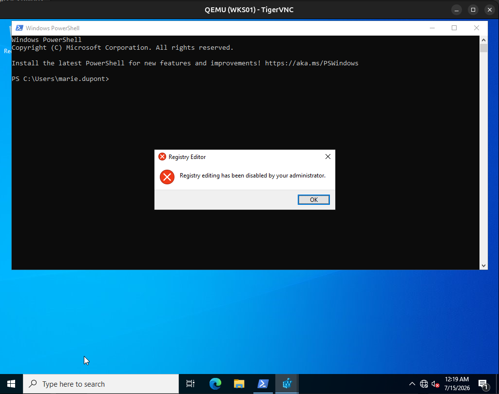

**Audit — échec de connexion capturé (Event 4625) :**

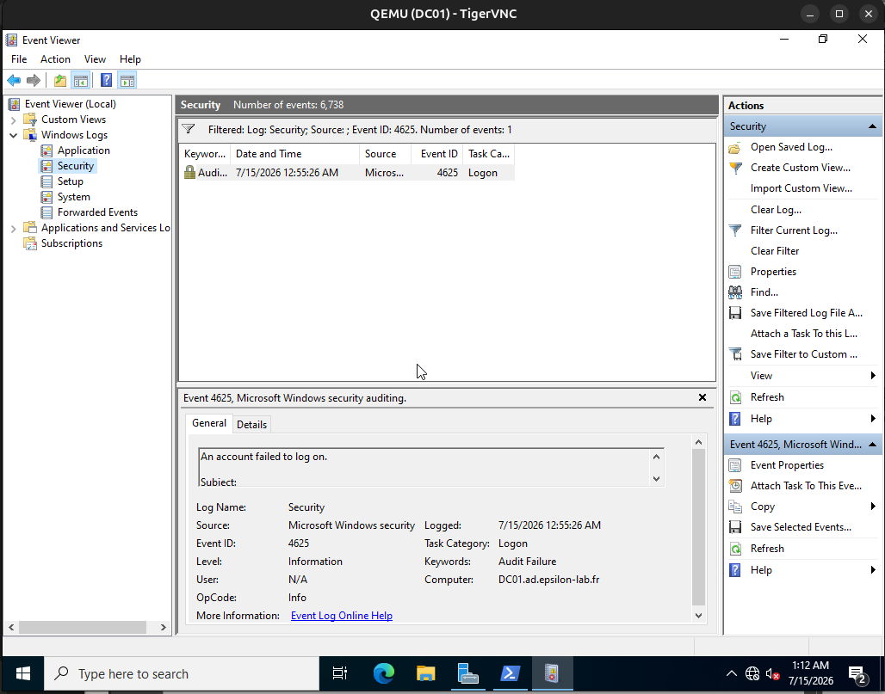

> La restriction empêche, l'audit révèle. En production, ces journaux sont centralisés dans
> un SIEM, avec une règle de corrélation qui alerte dès plusieurs 4625 rapprochés sur un
> même compte. C'est la défense en profondeur.

---

## Pièges rencontrés et résolus

| Symptôme | Cause | Résolution |
|---|---|---|
| `Inconsistent parameters ... Dhcp Enabled` | IP statique refusée tant que le DHCP est actif | Désactiver le DHCP (`Set-NetIPInterface -Dhcp Disabled`) avant de poser l'adresse |
| `NetAdapter.Status : Disconnected` | Nœud non câblé sur le canevas | Câbler la machine au switch avant de configurer l'IP |
| IP perdue au redémarrage (`169.254.x.x`) | Adresse posée dans l'`ActiveStore` (volatile) | Forcer `-PolicyStore PersistentStore` |
| `The server is unwilling to process the request` | Faute de frappe dans le DN (`espsilon`) | Utiliser les variables plutôt que retaper le chemin |
| Clavier en QWERTY | Disposition non appliquée au système | `Set-WinUserLanguageList -LanguageList fr-FR -Force` |
| `No events were found` (audit) | Aucun échec encore généré | Provoquer un échec volontaire, puis rechercher le 4625 |

---

## Scripts

| Script | Rôle |
|---|---|
| [`scripts/01-config-dc.ps1`](scripts/01-config-dc.ps1) | Config réseau, renommage, promotion du contrôleur |
| [`scripts/02-setup-annuaire.ps1`](scripts/02-setup-annuaire.ps1) | OU, groupes, utilisateurs, affectations |
| [`scripts/03-config-wks01.ps1`](scripts/03-config-wks01.ps1) | Config réseau du client, jonction au domaine |
| [`scripts/04-gpo-durcissement.ps1`](scripts/04-gpo-durcissement.ps1) | Politique de mot de passe, restrictions, audit |

> Les réglages GPO reposant sur des templates administratifs (restrictions d'interface,
> catégories d'audit) se configurent via la console GPMC ; les étapes sont documentées en
> commentaire dans `04-gpo-durcissement.ps1`.

---

## Environnement

Ubuntu 24.04 · 16 Go RAM · KVM · GNS3 2.2 · QEMU · Windows Server 2022 (évaluation 180 j)